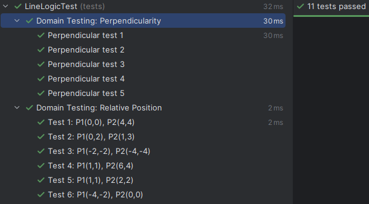

# Task #4 - Unit Testing and Domain Analysis

## 1. Task Overview
Given a straight line (I): **-3x + 5y - 2 = 0**.  
The goal is to determine the relative position between this line and a line segment (II) defined by two integer points $(x1, y1)$ and $(x2, y2)$.

## 2. Domain Testing Table
The following test cases cover ordinary scenarios, boundary values, and specific requirements (perpendicularity).

| ID | Test Scenario | Point 1 (x,y) | Point 2 (x,y) | Expected Relative Position | Perpendicular | End on Line |
|:---|:---|:---|:---|:---|:---|:---|
| TC1 | Crossing (different sides) | (0, 0) | (4, 4) | ONE common point | No | None |
| TC2 | No crossing (same side) | (0, 2) | (1, 3) | No common points | N/A | None |
| TC3 | Boundary: Both ends on line| (1, 1) | (6, 4) | Lies on the line | N/A | Both |
| TC4 | Boundary: End 1 on line | (1, 1) | (2, 2) | ONE common point | No | Point 1 |
| TC5 | Perpendicular Crossing | (1, 1) | (4, -4)| ONE common point | **Yes** | Point 1 |
| TC6 | Perpendicular Crossing | (1, 1) | (-2, 6)| ONE common point | **Yes** | Point 1 |
| TC7 | Non-Perp Crossing | (1, 1) | (3, 3) | ONE common point | **No** | Point 1 |

## 3. Picked Values Explanation
*   **Point (1, 1):** Selected as a **Boundary Value**. Plugging it into the equation: $-3(1) + 5(1) - 2 = 0$. This confirms the point lies exactly on the line.
*   **Point (6, 4):** Selected as another **Boundary Value**. $-3(6) + 5(4) - 2 = -18 + 20 - 2 = 0$.
*   **Vector (3, -5) and (-3, 5):** These vectors are parallel to the line's normal vector $\vec{n}(-3, 5)$. They are used to test the **Perpendicularity** requirement.
*   **Points (0,0) and (4,4):** These points yield different signs for the function ($f=-2$ and $f=6$), ensuring a crossing scenario.

## 4. Perpendicularity Logic
The straight line has a normal vector $\vec{n}(-3, 5)$. A segment is perpendicular to the line if its direction vector $\vec{v}(dx, dy)$ is parallel to the normal vector.  
Mathematical condition: $dx/A = dy/B \Rightarrow 5dx + 3dy = 0$.

## 5. Unit Test Execution
Tests were implemented using **JUnit 5** framework. Parameterized tests (`@ParameterizedTest` and `@CsvSource`) were used to ensure broad coverage of the domain results table.
#

